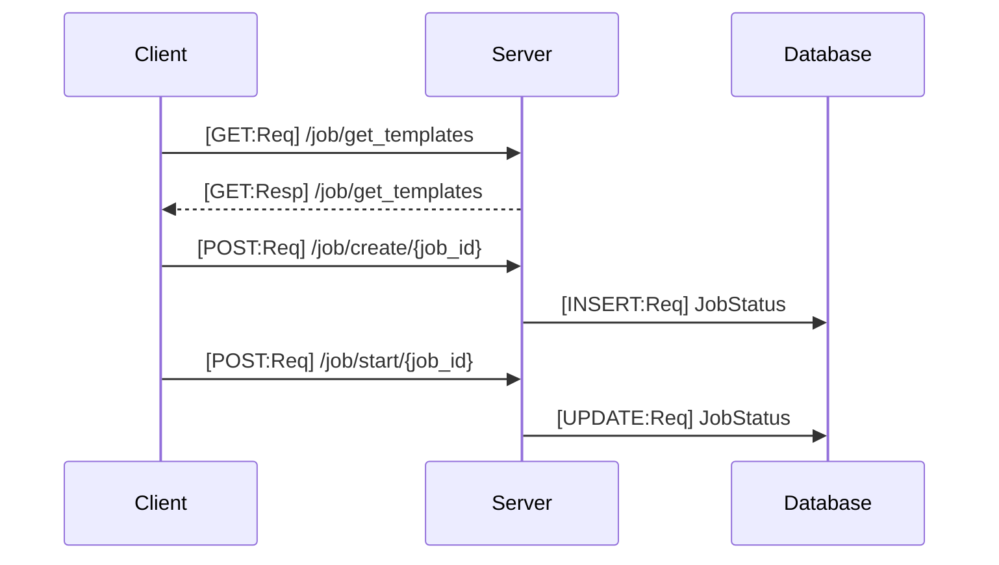
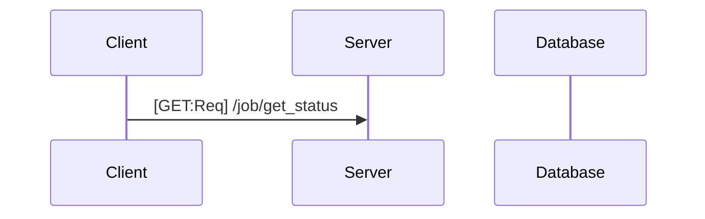
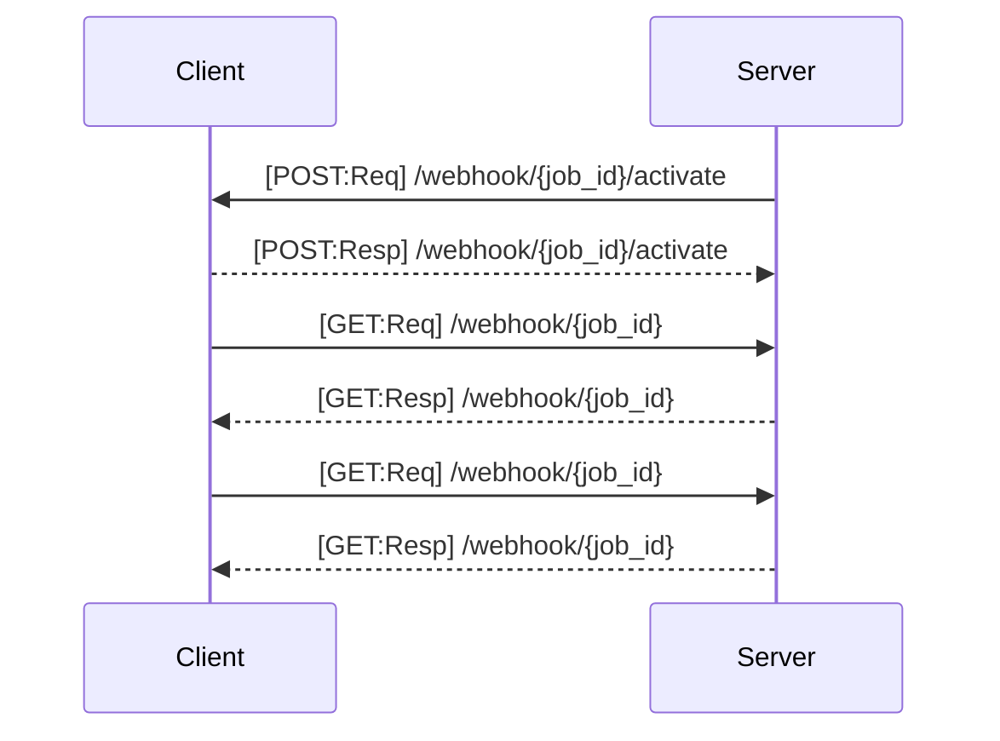

# Running a Job

## Creating a New job

```mermaid
sequenceDiagram
    participant Client
    participant Server
    participant Database
    Client->>Server: [GET:Req] /job/get_templates
    Server-->>Client: [GET:Resp] /job/get_templates
    Client->>Server: [POST:Req] /job/create/{job_id}
    Server->>Database: [INSERT:Req] JobStatus
    Client->>Server: [POST:Req] /job/start/{job_id}
    Server->>Database: [UPDATE:Req] JobStatus 
```

### 1. Request job template(s)

### 2. Send the parameters

### 3. Start the job

## Checking Job Status

```mermaid
sequenceDiagram
    participant Client
    participant Server
    participant Database
    Client->>Server: [GET:Req] /job/get_status

```

## Listening to Webhook

```mermaid
sequenceDiagram
    participant Client
    participant Server
    Server->>Client: [POST:Req] /webhook/{job_id}/activate
    Client-->>Server: [POST:Resp] /webhook/{job_id}/activate
    Client->>Server: [GET:Req] /webhook/{job_id}
    Server-->>Client: [GET:Resp] /webhook/{job_id}
    Client->>Server: [GET:Req] /webhook/{job_id}
    Server-->>Client: [GET:Resp] /webhook/{job_id}
```
